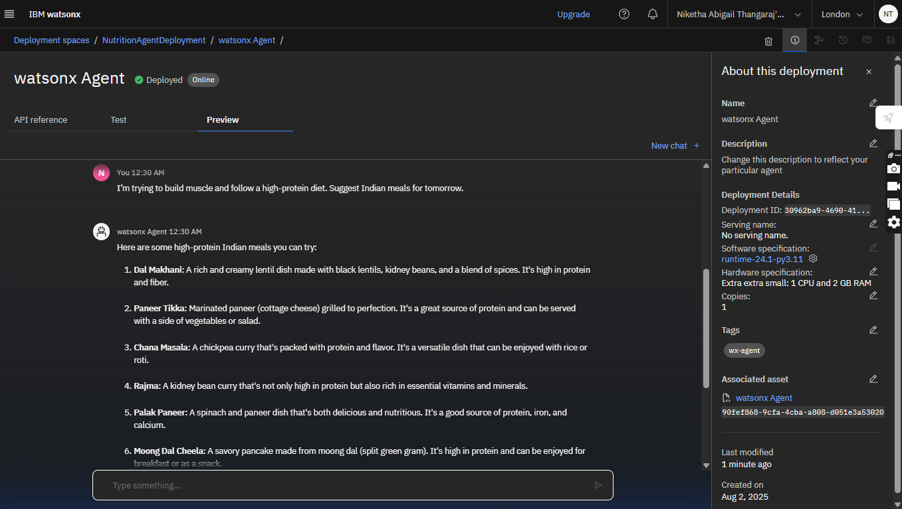

# 🥗 Nutrition Agent: The Smartest AI Dietician

> Personalized. Adaptive. Multimodal. Built with IBM Watsonx + Granite.

---

## 📌 What Is Nutrition Agent?

**Nutrition Agent** is an intelligent virtual assistant that helps you eat better, smarter, and more personally.  
Whether you're diabetic, gluten-sensitive, vegetarian, or trying to lose weight — this AI *knows* your plate.

Built using **IBM Watsonx**, **Granite LLMs**, and **Agent Builder**, it crafts meal plans based on your health conditions, lifestyle, fitness goals, cultural preferences, and even real-time feedback.

---

## 💡 Why This Matters

Most diet apps are boring and generic. They can’t explain *why* something is better.  
Nutrition Agent gives you **contextual, expert-level food advice** — in plain English, or even from a photo.

---

## 🔥 Key Features

- Generate dynamic, personalized meal plans  
- Accept inputs via text, voice, or food label photos  
- Tailor plans to allergies, medical conditions, or diets  
- Explain “Why this food?” using nutrition-backed logic  
- Learn and adapt with continuous feedback  
- Built-in cultural sensitivity for Indian + global diets

---

## 🛠️ Tech Stack

| Tool                                 | Use                           |
|--------------------------------------|-------------------------------| 
| IBM Watsonx.ai                       | Agent building and testing    |
| IBM Granite Foundation Model         | Generative AI                 |
| IBM Agent Builder                    | No-code deployment            |
| Retrieval-Augmented Generation (RAG) | Nutritional grounding         |
| IBM Cloud Lite                       | Hosting and runtime           |

---

## 📷 Screenshots

  
*Sample user prompt*

  
*Personalized meal plan generated by the agent*

---
